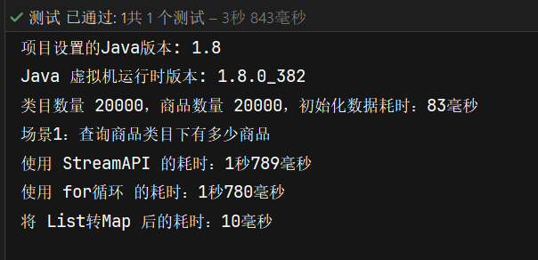

``` java
#代码片段
#Stream api
for (ProductCategoryPO categoryPO : categoryPOList) {
            List<ProductSpuPO> spuList = productSpuPOList.stream()
                    .filter(x-> Objects.equals(x.getCategory(),categoryPO.getId()))
                    .collect(Collectors.toList());
        }
#for循环
for (ProductCategoryPO categoryPO : categoryPOList) {
            List<ProductSpuPO> spuListTemp =new ArrayList<>();
            for (ProductSpuPO spuPO: productSpuPOList ){
                if( Objects.equals(spuPO.getCategory(),categoryPO.getId())){
                    spuListTemp.add(spuPO);
                }
            }
        }
#先转成Map   
Map<Integer,List<ProductSpuPO>> categoryMapSpuList= productSpuPOList.stream()               .collect(Collectors.groupingBy(ProductSpuPO::getCategory,Collectors.toList()));
for (ProductCategoryPO categoryPO : categoryPOList) {
    List<ProductSpuPO> spuListTemp = categoryMapSpuList.get(categoryPO.getId());
}
```
